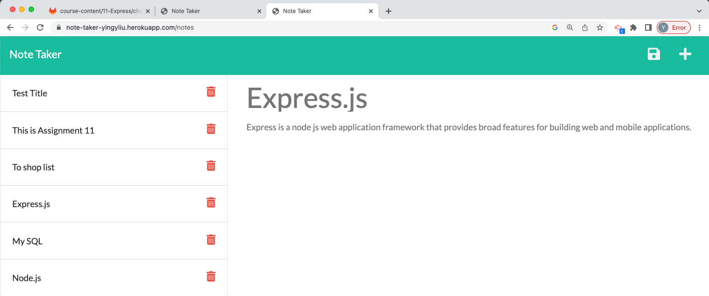
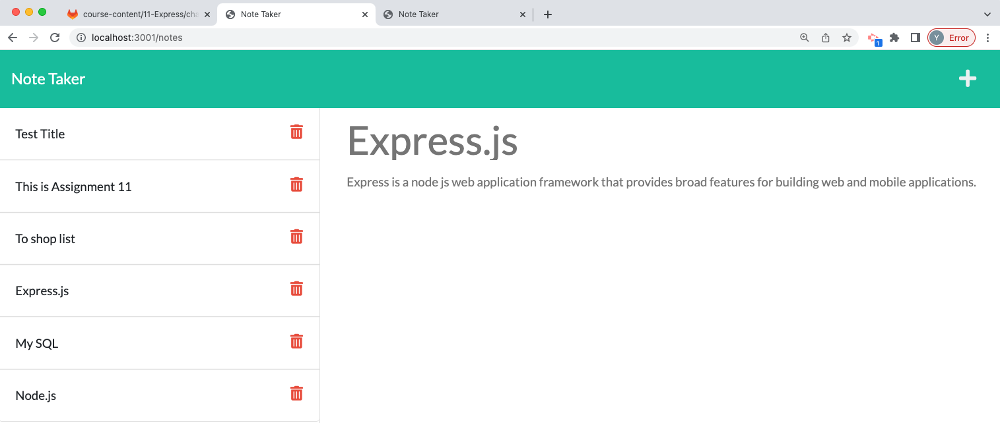

# note-taker

## Application to Heroku
https://note-taker-yingyliu.herokuapp.com/

## At Local Host

## Table of Contents
- [Description](#description)
- [Tech used](#tech-used)
- [Use](#use)
- [Learning point](#learning-point)
- [Link](#link)
- [License](#license)

## Description
This note taker enable user to write and save notes.

## Tech used
- JavaScript
- Node.js
- Express.js
- GitHub
- Heroku
- Terminal
- Visual Studio Code

## Use
- Step 1: Open http://localhost:3001/
- Step 2: Write notes on right column.
- Step 3: Click on the Save icon.
- Step 4: The new note will be saved and appears on the left column.
- Step 5: Keep adding new note(s) if necessary.
- Step 6: Click the existing notes in the list, it will appear on the right column again.

## Learning point
- I learn how to install express with node js. 
- I learn how to install uuid from npm.
- I learn how to use localhost PORT to run the web.
- I learn how to use route to GET/POST request.

## Link
https://yingyliu.github.io/note-taker/

## License
